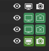
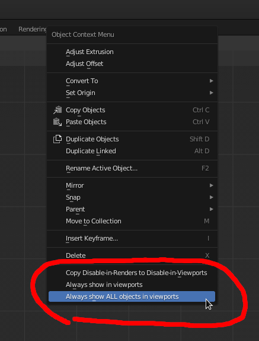
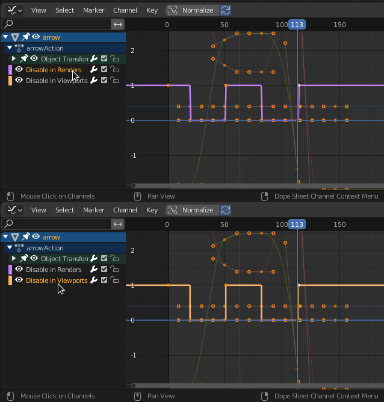

# Blender add on: Synchronise 'Disable in Viewports' with 'Disable in Renders'

By default, in blender, if you animate the "Disable in Renders" property of an object, so that it sometimes is visible on screen, and sometimes isn't, then you can't easily preview your animation.

These are the buttons I'm talking about:

As soon as you have a bunch of different things that are all supposed to appear and disappear at specific times, you just see a mess of objects overlapping in the viewport.

This plugin partially solves this problem (while we wait for blender to implement a better solution)

## What you get

These three buttons are added to the 3D view context menu:

Select some objects, and then right click (or whatever you use to summon the context menu) and choose one of these buttons.

When you copy Disable in Renders to Disable in Viewports, you will see that both f-curves now look the same:

Choosing "Always show in viewports" simply deletes the f-curve for "Disable in Viewports"

## How to install this

 1. Download `sync_hide_viewport.py`
 2. Open the blender add-on manager window (Edit -> Preferences -> Add-ons)
 3. Click the "Install..." button
 4. Select the downloaded `sync_hide_viewport.py` file and click "Install Add-on"

## How to use

Select some objects in a 3D view, right click anywhere in the 3D view, and use the two new menu options:

 - "Copy Disable-in-Renders to Disable-in-Viewports" <- operates on the selection[1]
 - "Always show in viewports" <- operates on the selection[1]
 - "Always show ALL in viewports" <- operates on all objects in the scene

## Bugs, issues, suggestions

This is a quick thing that I threw together, and I haven't tested it much yet. There's not much that can go wrong, but it's possible that there are issues with it. Feel free to use the issues tab above to report any issues that you find with this add-on. I can't prommise to fix anything quickly, but please do submit reports anyway :)

Thanks.

## Gotchas

[1] Even if an object is selected, these operations will not do anything if the object is disabled in the viewport. This is a side effect of a deliberate part of the blender UX design that prevents operators from changing things about objects that cannot be seen by the user right now. This is expected, but sometimes not desirable. To make sure this operator works on a specific object you need to make sure you unhide that object in viewports. Alternatively, you can use "Always show ALL in viewports" to bring make all operations work on all objects again.
